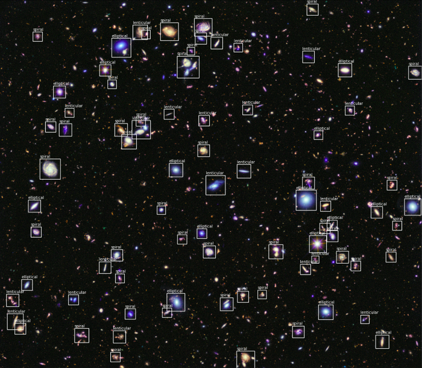

### Projects
***
#### Conditional Similarity Learning for Multilabel Classification of Medical Images
Bachelor Thesis supervised by Prof. Ommer at Heidelberg University (Jan. - Jul. 2021)

This thesis follows the idea of making a neural network learn a *disentangled* embedding space for medical images 
displaying lung diseases. The embedding space is therefore divided into one subspace per disease. This approach increases
the classification performance and enables the NN to encompass information about the similarity of different diseases. \
The work on this project has been continued afterwards as a student assistant. The classification performance has been
further improved and new techniques have been applied such as proxy anchor loss. The results are planned to be 
published in the beginning of 2023.

Most important papers that have been used or reimplemented for the bachelor thesis:
* Wang, X., Han, X., Huang, W., Dong, D., & Scott, M. R. *Multi-similarity loss with general pair weighting for deep metric learning.* 2019.
IEEE/CVF Conference on Computer Vision and Pattern Recognition.
* Veit, A., Belongie, S., & Karaletsos, T. *Conditional similarity networks.* 2017.
IEEE conference on computer vision and pattern recognition.

Papers that have been used or reimplemented as a student assistant:
* Movshovitz-Attias, Y., Toshev, A., Leung, T. K., Ioffe, S., & Singh, S. *No fuss distance metric learning using proxies.* 2017.
IEEE International Conference on Computer Vision.
* Iscen, A., Tolias, G., Avrithis, Y., & Chum, O. *Mining on manifolds: Metric learning without labels.* 2018.
IEEE Conference on Computer Vision and Pattern Recognition.
* Kazemzadeh, S., Yu, J., Jamshy, S., Pilgrim, R., Nabulsi, Z., Chen, C., ... & Prabhakara, S. 
*Deep Learning Detection of Active Pulmonary Tuberculosis at Chest Radiography Matched the Clinical Performance of Radiologists.* 2022.
 Radiology, 212213.

Applied machine learning techniques: unsupervised and supervised techniques, deep metric learning; for more see papers \
Programming language and frameworks: Python, Tensorflow, Jax, Pandas and others
---

#### Bias Free AI
Hackathon Challenge by IBM at Q-Summit Mannheim (Oct. 2021)

Applied machine learning techniques: k-means clustering, kNN classification
Programming language and frameworks: Python, scikit-learn

---

#### Galaxy Detection and Classification in the Hubble Deep Field
Project for the "Deep Vision" Course at Heidelberg University (Jul. 2020)

The problem formulation and solving was created in a team of 2. The problem can be separated into a classification and
detection problem. For the first part of the problem a CNN has been trained with a dataset of galaxy images and labels.
For the second part fixed-level thresholding has been performed to get bounding boxes and image cut-outs that can be fed
into the pretrained network. The result can be seen in the following picture.

Applied machine learning techniques: CNN classification, segmentation, bounding box approach \
Programming language and frameworks: Python, PyTorch, NumPy

---

#### Eigenfaces R package
Project for the "Programming Language R and its Applications" course at Heidelberg University (Jul. 2020)

This Project contains the principle component analysis on a large set of images of different human faces (here: Olivetti Dataset).
The derived eigenvectors are called eigenfaces, hence the project name. Methods like this can be used for human face recognition.
More details can be found in the read me of the following
<a href="https://github.com/Osburg/eigenfaces" > github repository</a>.

Applied machine learning techniques: PCA, kNN classification \
Programming language and frameworks: R, shiny, testthat

---

<a href="https://mafi2.github.io/" >back to main page</a>